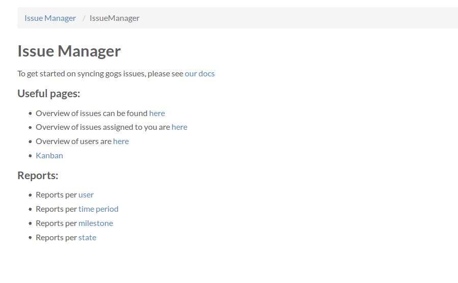
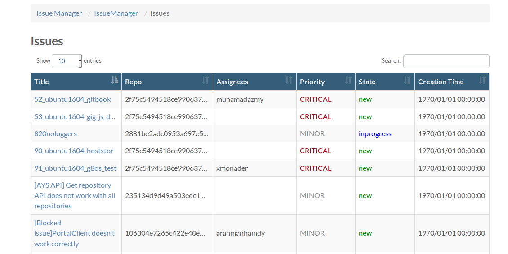
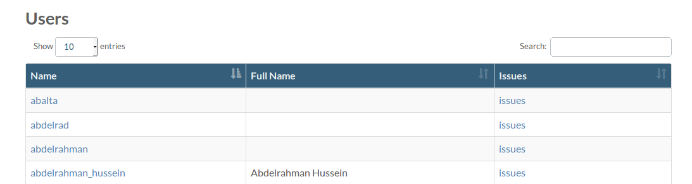
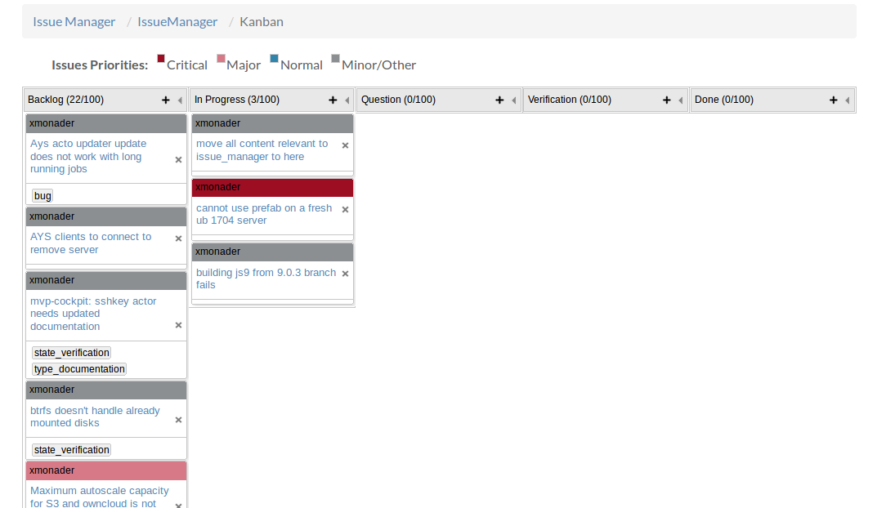

# IssueManager

IssueManager is a portal9 application used to provide a kanban overview for Issues.

## Installation
### Manual Installation
1- Make sure to have portal9 installed. (See: https://github.com/Jumpscale/portal9/blob/master/docs/GettingStarted/Installation.md)

2- Clone issue_manager (https://github.com/Jumpscale/issue_manager/)

3- Copy/link apps/IssueManager to your portal applications directory `opt/jumpscale9/apps/portals/main/base`


### Prefab Installation
`prefab.apps.issuemanager.install()`


## Howto sync data
See (https://docs.greenitglobe.com/gig/cockpit_issue_manager) for GIG internal setup.


### Syncing from Github:
You need to get client for your github.

```    
gl = j.clients.github.getClient(token)
gl.syncAllFromGithub(org1Name, org2Name, org3Name)
```
syncAllFromGithub will sync users, organizations, repos, and issues.

### Syncing from Gogs:
For GIG internals gogs data access and synchronization See (https://docs.greenitglobe.com/gig/cockpit_issue_manager)

In general you need to serialize data into a PostgreSQL instance with a valid gogs schema and then
generate capnp models in redis.


## Screenshots

Application Home page


Issues List


Users list


Kanban

